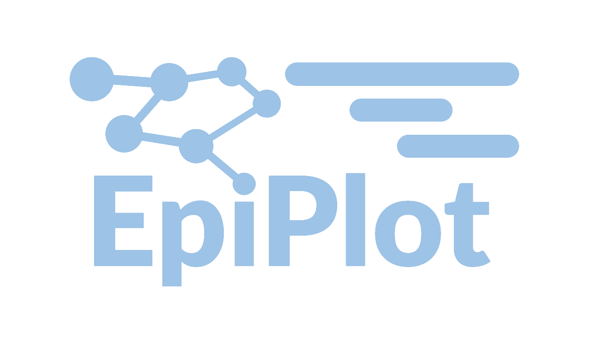

EpiPlot est une application web permettant de mettre en forme des données de mouvements de patients afin de produire un graphique de suivi des mouvements interactif ainsi que de construire un réseau. Un fichier avec les prélèvements effectués pour chaque patient (positifs et négatifs) peut être ajouté afin de visualiser les prélèvements sur le graphique et de trier les patients selon le génotype de leur souche.

